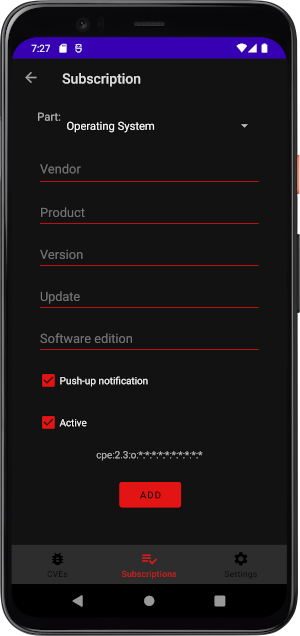

# Android CVE alert application

## About

Application to receive notifications about new CVE (Common Vulnerabilities and Exposures) for
products that interest you. The application stores the received CVEs in a local *Room* Database.

Feel free to contribute.

## API

The application uses the API of the *National Vulnerabilities Database (NVD)*. To obtain specific
CVE entries, the *CPE URL* is used. See the documentation
on: https://nvd.nist.gov/developers/vulnerabilities

## Requirements

Android device with minimum sdk version 26.

## ToDo

- *Active* and *enable/disable pushUp-notifications* options are not completly implemented
- Improve UI
- Improve navigation
- CPE search
- Add filter for timeline

## Screenshots

